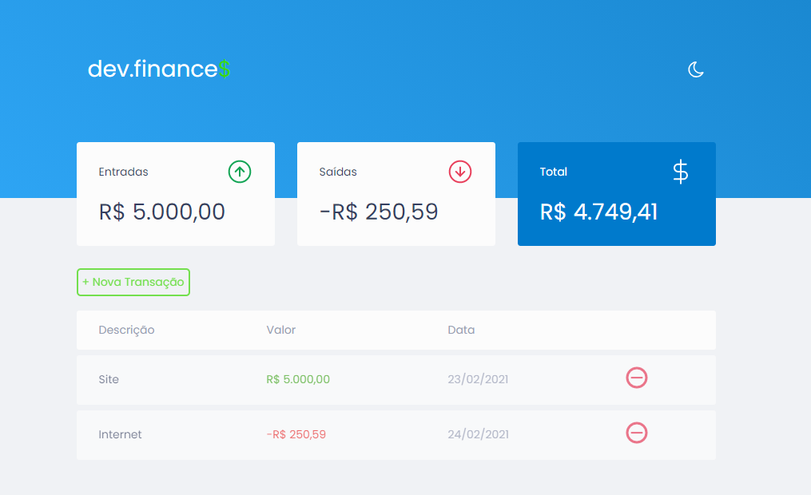
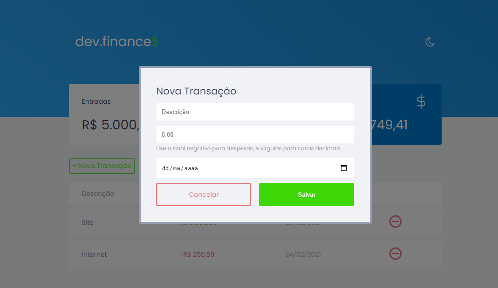
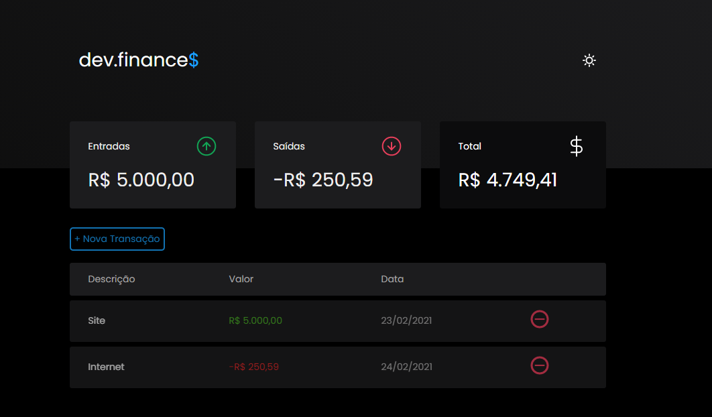
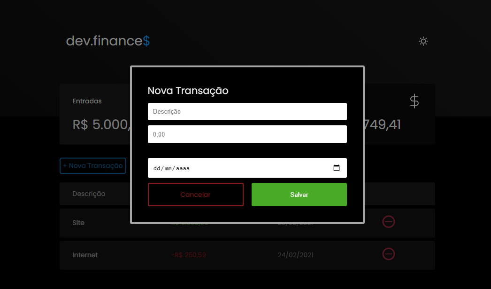
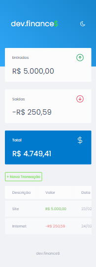
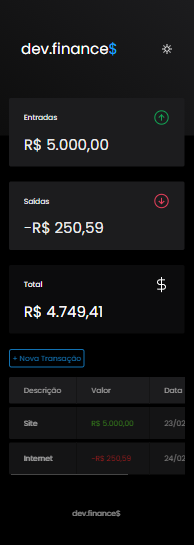

# Dev-Finance 📈

### _Projeto desenvolvido durante a Maratona Discover da Rocketseat_ 🚀 🚀 🚀

&nbsp;

---

## O que é:

&nbsp;

#### _Dev-Finance é um aplicativo para controle financeiro, onde podemos adicionar entradas e saídas._

&nbsp;

---

## Tecnologias utilizadas:

&nbsp;

-   HTML
-   CSS
-   Javascript
    &nbsp;

---

## Layout:

#### _As cores do layout foram modificadas, os tons de verde do projeto original foram substituídas por tons de azul._

&nbsp;

##### _Tela do aplicativo:_

&nbsp;

##### _Tela do modal para adicionar nova Transação:_

&nbsp;

---

## Modo dark-theme:

#### _Adicionei ao projeto um dark-theme, ou dark-mode, que não havia no original. A preferência fica salva no localstorage._

&nbsp;

##### _Tela do aplicativo:_

&nbsp;

##### _Tela do modal, versão dark-theme, para adicionar nova Transação:_

---

## Modo responsivo

#### _ O aplicativo tem sua versão responsiva para mobile e tablets: _

&nbsp;

##### _Aparência do aplicativo na versão mobile entre 320px e 720px:_

  

---

### Projeto feito por 🌸Elaine Delgado🌸 durante Maratona Discover 🚀 🚀 🚀
